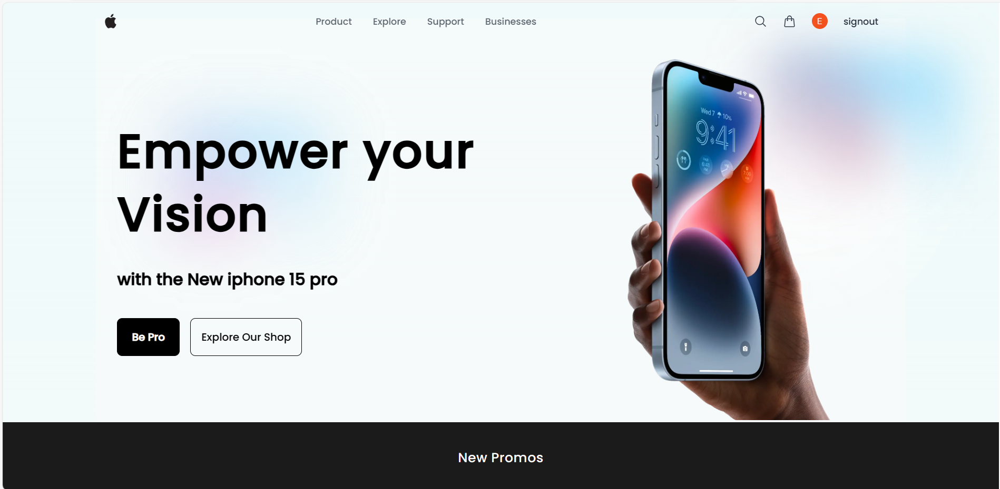
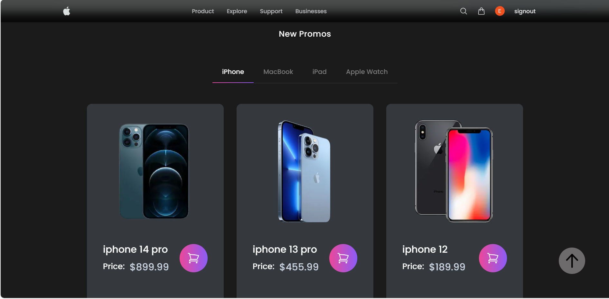
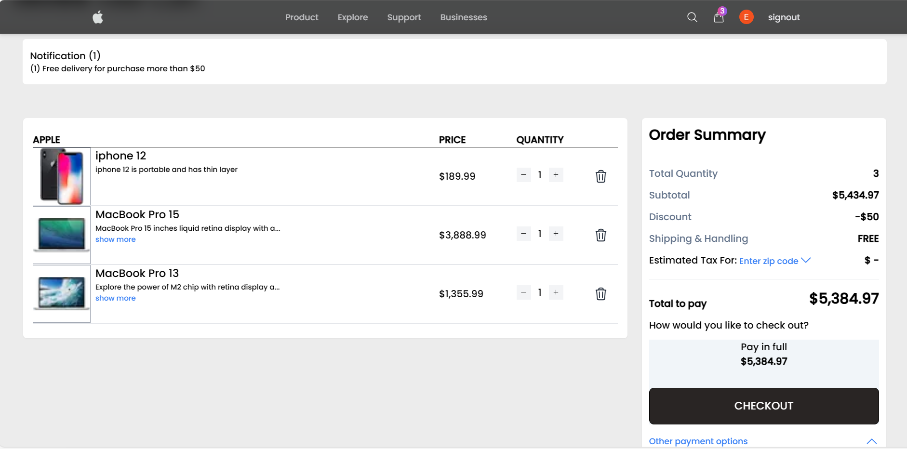
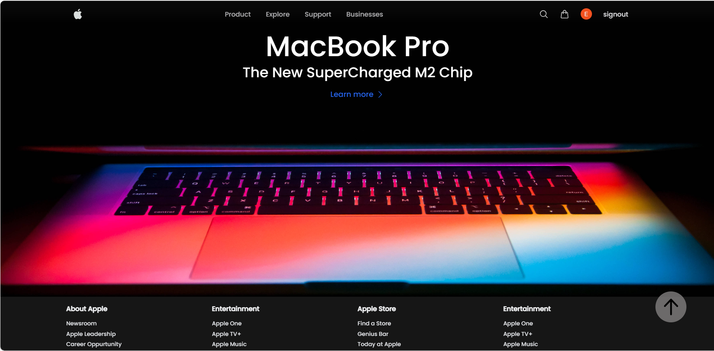
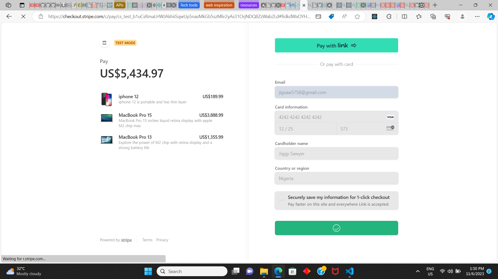
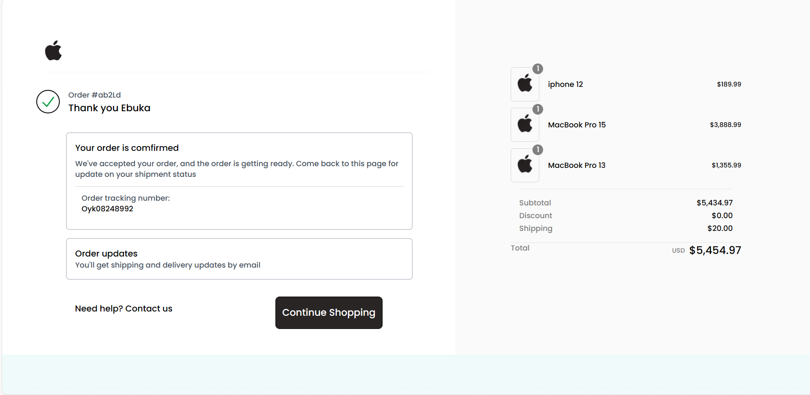

# Apple Ecommerce Redesign

#### _This is a redesign of the apple ecommerce store_

### Powered By

[](https://nextjs.org)

[](https://travis-ci.org/joemccann/dillinger)

This project is a complete redesign of Apple’s website using Next.js, Tailwind CSS, Redux Toolkit, and Sanity Studio. It is a web application that allows users to browse Apple products, add them to their cart, and checkout using Stripe API.

- ✨Magic ✨

## Features

**This project includes the following features:**

- A complete redesign of Apple’s website using Next.js, Tailwind CSS, Redux Toolkit, and Sanity Studio.
- A responsive design that works on all devices.
- A shopping cart that allows users to add and remove products.
- A checkout process that uses Stripe API to process payments.
- User Authentication with NextAuth and social media login

The Project helped me to gain tons of knowledge on both front end and backend development, i learnt a lot of key concepts in javascript and REST API functionalities.
In addition, I gained adept knowledge on state management with redux toolkit and also had the oppurtunity to work with nextjs 13.4 and it's latest features which includes RSC, app route handlers and SSR.

> The Ultimate goal of this project is to create a user-friendly interface
> effective user-friendly functionalities,
> simple navigation, well structured layouts and Search Engine Optimization.

### Screenshots

_Home Page_
;

_Products_
;

_Checkout Products_
;

_Hero Section_
;

_Sripe checkout session_
;

_sucess page_
;

## Technologies used

**The project used the following technologies**

- [Next.js](https://nextjs.org/) - The React framework for the web
- [Tailwind CSS](https://tailwindcss.com/) - A Frontend library for creating beautiful UI
- [Redux Toolkit](https://redux-toolkit.js.org/) - toolset for efficient app state management
- [Sanity Studio](https://www.sanity.io/) - A Headless CMS for content management
- [Stripe API](https://stripe.com/) - A Payment processing platform

## Installation

Apple Ecommerce requires [Node.js](https://nodejs.org/) v10+ to run.

Install the dependencies and devDependencies and start the server.

**To get started with this project follow the steps:**

- Clone the repository to your local machine

```sh
cd apple-redesign
//Install the dependencies using
npm install
//run the development server using
npm run dev

//Open http://localhost:3000 with your browser to see the result
```

For production environments...

```sh
npm run build --production
```

This is a [Next.js](https://nextjs.org/) project bootstrapped with [`create-next-app`](https://github.com/vercel/next.js/tree/canary/packages/create-next-app).

## Getting Started

First, run the development server:

```bash
npm run dev
# or
yarn dev
# or
pnpm dev
# or
bun dev
```

Open [http://localhost:3000](http://localhost:3000) with your browser to see the result.

You can start editing the page by modifying `app/page.tsx`. The page auto-updates as you edit the file.

This project uses [`next/font`](https://nextjs.org/docs/basic-features/font-optimization) to automatically optimize and load Inter, a custom Google Font.

## Learn More

To learn more about Next.js, take a look at the following resources:

- [Next.js Documentation](https://nextjs.org/docs) - learn about Next.js features and API.
- [Learn Next.js](https://nextjs.org/learn) - an interactive Next.js tutorial.

You can check out [the Next.js GitHub repository](https://github.com/vercel/next.js/) - your feedback and contributions are welcome!

## Deploy on Vercel

The easiest way to deploy your Next.js app is to use the [Vercel Platform](https://vercel.com/new?utm_medium=default-template&filter=next.js&utm_source=create-next-app&utm_campaign=create-next-app-readme) from the creators of Next.js.

Check out our [Next.js deployment documentation](https://nextjs.org/docs/deployment) for more details.

## License

MIT
